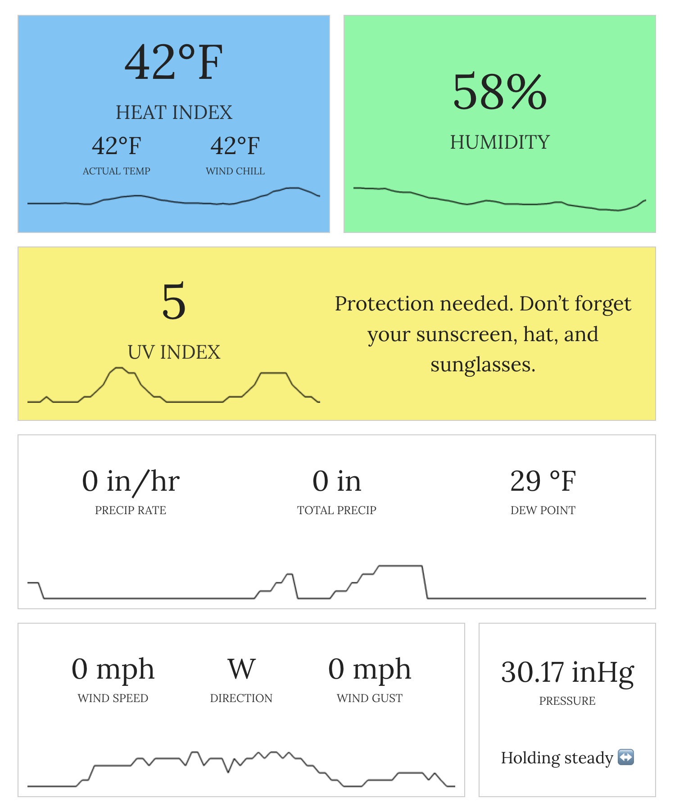

# wunderground-pws-wp-blocks

Fetches weather data from Wunderground for a personal weather station and outputs it with a Gutenberg block.

Here is how it looks on the frontend:

 

## Installing
- Download this repo as a zip, then upload it to your WordPress Plugins area, install, and activate.
- Settings page: /wp-admin/tools.php?page=wu-pws-settings
- Add your API key from [Wunderground](https://www.wunderground.com/member/api-keys)
- Add your Personal Weather Station ID

Block name: __Wunderground PWS Current Weather__

## Development
Clone this repo, then run `npm install`. Make changes. Run `npm run build`.

## Changelog
- 2023-03-16 - 0.2.0 beta version with design and sparklines. No mobile version.
- 2023-03-05 - 0.1.0 Initial working version. No frills.
